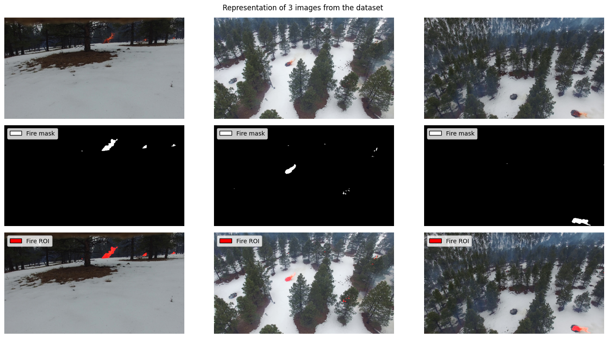
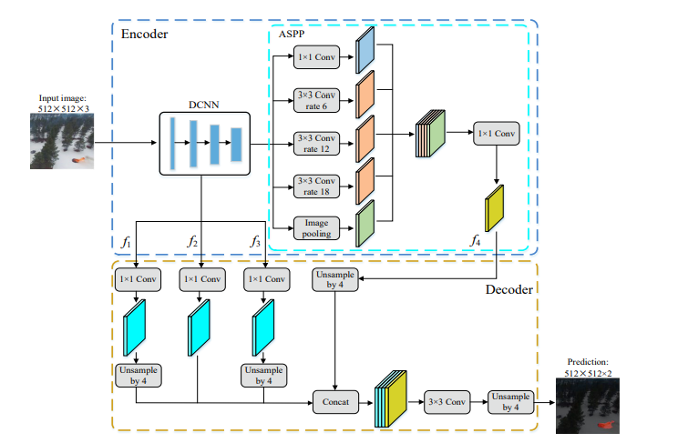

# :fire: Unofficial implementation of "A Real-time Fire Segmentation Method Based on A Deep Learning Approach" :evergreen_tree: :deciduous_tree:

[](https://paperswithcode.com/sota/real-time-semantic-segmentation-on-flame?p=a-real-time-fire-segmentation-method-based-on)

Detecting and localizing woodland fires quickly and accurately is essential to prevent forest fires from becoming large and difficult to control, which can save money and resources that would otherwise be spent on fire suppression efforts. Moreover, a fast and precise recognition of forest fires can help protect the environment by minimizing the damage to ecosystems and preserving habitats for wildlife.

This project aims at reproducing the experiment proposed in the paper [*A Real-time Fire Segmentation Method Based on A Deep Learning Approach*](./docs/A%20Real-time%20Fire%20Segmentation%20Method%20Based%20on%20A%20Deep%20Learning%20Approach.pdf) <a name="cite_paper"></a>[<sup>[1]</sup>](#note_paper).

The work consists in the development of an improved version of *Deeplabv3+* that aims at predicting forest fires from images of drones, while increasing the segmentation speed and preserving the segmentation accuracy.

<div align="center">

  

</div>

* For more detailed informations about the used functions, look into the corresponding docstrings inside the python files, inside the `src` folder.

* The training, validation and prediction scripts are available in the `script` folder.

* The dataset used in the experiment is available at the following [link](https://ieee-dataport.org/open-access/flame-dataset-aerial-imagery-pile-burn-detection-using-drones-uavs).
In particular, the user should download the images of fires (*9) Images for fire segmentation (Train/Val/Test) Images.zip*) and the related masks (*10) Masks annotation for fire segmentation (Train/Val/Test) Masks.zip*) zip files in the section *"Dataset Files"* and copy them in the folder `./data`.

---
<small>

<a name="note_paper"></a>[1] Menga Li et al. “A Real-time Fire Segmentation Method Based on A Deep Learning Approach”. In: *IFAC-PapersOnLine*. 2022. url: https://www.sciencedirect.com/science/article/pii/S2405896322005055.

</small>

## Description
The work consists in the development of an improved version of *Deeplabv3+*, which is an encoder-decoder network used for semantic segmentation tasks. Differently from that model, it uses the lightweight *Mobilenetv3* network in the decoding operations to increase the segmentation speed. For the same reason, it also avoids *atrous convolutions* in spite of losing segmemntation accuracy. In order to compensate for this loss the proposed network introduces two additional shallow features to the decoder rich in pattern information of the input images.

<div align="center">

  

</div>


The first step is to prepare the data for training the model. It consists of a set of images and the respective masks. The images are aerial images of fire, and the masks are binary masks that indicate the semantic segmentation of the fire.

The data is split into a training set, a validation set, and a test set.

The model is trained on the training set, and its performance during training is evaluated on the validation set. After the training process is complete, the model is then evaluated on the test set.

The project uses the following metrics to evaluate the model:

* Mean Pixel Accuracy (MPA)
* Mean Intersection over Union (MIoU)
* Frames Per Second (FPS)

The results of the model are evaluated on the test set and compared to the outcomes of the original paper.

|          | Original Paper | Our results |
| :------- | :------------: | :---------: |
| MPA      | 92.46 %        |  94.3 %     |
| MIoU     | 86.98 %        |  86.1 %     |
| FPS      | 59             |  58         |

## Interface

In order to train and use the model for predictions, follow these steps:

1. Clone the repository.
2. Install the required dependencies.
3. Run the [training process](scripts/train.py) to train the model.
4. Run the [validation process](scripts/validation.py) to evaluate the model predictions on the validation and test datasets.
3. Run the [prediction process](scripts/predict.py) in order to predict the fire segmentation mask of an input image.

### Training process
The [training process](scripts/train.py), provides a *Python* script to execute the task of training the fire segmentation model. It builds the train and validation datasets after loading the images and their segmentation masks. Then it builds the model, sets the optimizer and the learning rate schedulers. Finally it trains the model on the train set with the provided hyperparameters. The best model weights are saved according to the results on the validation datasets after every $200$ batch steps and after every epoch. Data augmentation is performed on the train dataset to enhance the model performances.

The checkpoints of the model and the mean and standard deviation computed on the train dataset are saved in the provided file paths.

The following optional non positional arguments are present:
* `--images-zip-path`, `-imgs` (default='data/Images.zip'): The path of the aerial images of the woodland fires zip file.
* `--masks-zip-path`, `-msks` (default='data/Masks.zip'): The path of the woodland fires segmentation masks zip file.
* `--checkpoint-file-path`, `-ckpt` (default='model/checkpoints.pth'): The path of the file where the model checkpoints are saved.
* `--train-mean-std-file-path`, `-ms` (default='model/mean-std.npy'): The file path where the train mean and standard deviation are saved.
* `--seed`, `-s` (default= $42$ ): The seed used for reproducibility.
* `--device`, `-d` (default=`None`): The device to use for training. If not provided, it is set automatically.
* `--train-batch-size`, `-tb` (default= $2$ ): The batch size used for training.
* `--eval-batch-size`, `-eb` (default= $2$ ): The batch size used for evaluation.
* `--epochs`, `e` (default= $30$ ): The number of epochs to train the model.

⚠ **Warning for reproducibility**

*Code is not fully reproducible because the upsampling algorithms `upsample_bilinear2d` adopted in the *Decoder* module is not deterministic. This operation may produce nondeterministic gradients when given tensors on a CUDA device. Different results may be obtained when re-running the pipeline.*

### Validation process
The [validation process](scripts/validate.py), provides a *Python* script to execute the task of validating the fire segmentation model. It builds the train and validation datasets after loading the images and their segmentation masks. Then it builds the segementation model and loads its trained weights. Finally it evaluates the model on the validation and test datasets.

The following optional non positional arguments are present:
* `--images-zip-path`, `-imgs` (default='data/Images.zip'): The path of the aerial images of the woodland fires zip file.
* `--masks-zip-path`, `-msks` (default='data/Masks.zip'): The path of the woodland fires segmentation masks zip file.
* `--checkpoint-file-path`, `-ckpt` (default='model/checkpoints.pth'): The path of the file where the model checkpoints are loaded.
* `--train-mean-std-file-path`, `-ms` (default='model/mean-std.npy'): The file path where the train mean and standard deviation are loaded.
* `--seed`, `-s` (default=42): The seed used for reproducibility.
* `--device`, `-d` (default=None): The device to use for training. If not provided, it is set automatically.
* `--eval-batch-size`, `-eb` (default=2): The batch size used for evaluation.

### Prediction process
The [prediction process](scripts/predict.py), provides a *Python* script to execute the task of predicting the fire segmentation mask of a specific image through the model. It loads an image at a provided index. Then it builds the segementation model and loads its trained weights. Finally it predicts the segmentation mask on the considered image and plots the original image, the segmentation mask and the highlighted mask over the image.

The script positional arguments are:
* `image-number`: The number of the image in the zip file for which segmentation is predicted.

The following optional non positional arguments are present:
* `--images-zip-path`, `-imgs` (default='data/Images.zip'): The path of the aerial images of the woodland fires zip file.
* `--checkpoint-file-path`, `-ckpt` (default='model/checkpoints.pth'): The path of the file where the model checkpoints are loaded.
* `--train-mean-std-file-path`, `-ms` (default='model/mean-std.npy'): The file path where the train mean and standard deviation are loaded.
* `--device`, `-d` (default=None): The device to use for training. If not provided, it is set automatically.

## Usage

### Training process
The following shell command executes the training process with default arguments.
```sh
python scripts/train.py
```

### Validation process
The following shell command executes the validation process with default arguments.
```sh
python scripts/validate.py
```
### Prediction process
The following shell command executes the prediction process with default arguments on the $1,000^{th}$ image of the dataset.
```sh
python scripts/predict.py 1000
```

## Repository structure

    .
    ├── images                                          # Directory containing images that are shown in the notebook and the README.
    ├── data                                            # Directory containing the zip files of the woodland fire images and the respective segmentation masks.
    ├── docs
    │   └── A Real-time Fire Segmentation....pdf        # The original paper on which the work is based.
    ├── model
    │   ├── checkpoints.pth                             # The fire segmemntation model checkpoints.
    │   └── mean-std.npy                                # The mean and standard deviation computed on the train dataset.
    ├── scripts
    │   ├── __init__.py
    │   ├── predict.py                                  # Python script to perform predictions on the trained fire segmentation model.
    │   ├── train.py                                    # Python script to train the fire segmentation model.
    │   └── validate.py                                 # Python script to evaluate the performances of the fire segmentation model.
    ├── src
    │   ├── data
    │   │   ├── __init__.py
    │   │   ├── analysis.py                             # Python module containing functions to analyze the dataset.
    │   │   ├── dataloaders.py                          # Python module containing the dataloaders for the fire segmentation task.
    │   │   └── dataset_handler.py                      # Python module containing the functions to load the dataset and split it into train, validation and test sets.
    │   ├── model
    │   │   ├── __init__.py
    │   │   ├── model.py                                # Python module providing a class to define the Fire Segmentation Model.
    │   │   └── modules.py                              # Python module providing classes to define the modules of the network.
    │   ├── prediction
    │   │   ├── __init__.py
    │   │   ├── analysis.py                             # Python module containing functions to analyze the prediction results.
    │   │   └── predict.py                              # Python module for predicting the segmentation masks of images.
    │   ├── training
    │   │   ├── __init__.py
    │   │   ├── analysis.py                             # Python module containing functions for analyzing the training history of the model.
    │   │   ├── lion.py                                 # PyTorch implementation of the Lion optimizer.
    │   │   ├── metrics.py                              # Python module providing the necessary metrics to train and evaluate the model for the semantic segmentation task.
    │   │   ├── training.py                             # Python module containing functions for analyzing the training history of the model.
    │   │   └── utils.py                                # Python module providing the checkpoints monitor for the training of the semantic segmentation module.
    │   ├── utils
    │   │   ├── __init__.py
    │   │   └── seed.py                                 # Python module providing a functions to set the seed.
    │   └── __init__.py
    ├── Fire Segmentation Pipeline.ipynb                # Notebook illustrating the workflow pipeline.
    ├── .gitattributes
    ├── .gitignore
    ├── LICENSE
    └── README.md

## Dependencies
- [OpenCV](https://pypi.org/project/opencv-python/)
- [Matplotlib](https://matplotlib.org/)
- [NumPy](https://numpy.org/)
- [scikit-learn](https://scikit-learn.org/stable/)
- [PyTorch](https://pytorch.org/)

## Versioning

Git is used for versioning.

## Group members
<div align="center">

  |  Name           |  Surname  |     Email                           |    Username                                             |
  | :-------------: | :-------: | :---------------------------------: | :-----------------------------------------------------: |
  | Facundo Nicolas | Maidana   | `facundo.maidana@studio.unibo.it`   | [_maidacundo_](https://github.com/maidacundo)           |
  | Riccardo        | Spolaor   | `riccardo.spolaor@studio.unibo.it`  | [_RiccardoSpolaor_](https://github.com/RiccardoSpolaor) |

</div>

## License

This project is licensed under the MIT License - see the [LICENSE](LICENSE) file for details.

The Lion Optimizer [script](src/training/lion.py) is Copyright 2023 Google Research (All Rights Reserved). Its usage is licensed under the Apache License, Version 2.0.

Social preview by [Forest Fire Vectors by Vecteezy](https://www.vecteezy.com/free-vector/forest-fire).
